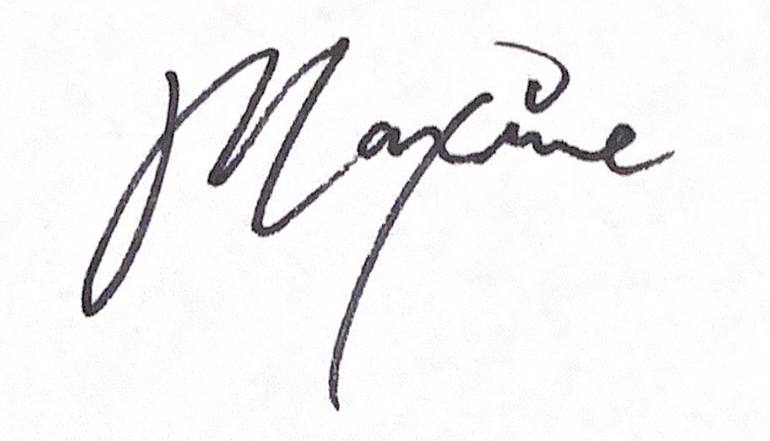

<a name="readme-top">

<br/>

<br />
<div align="center">
  <a href="https://github.com/zyx-0314/">
  <!-- TODO: If you want to add logo or banner you can add it here -->
    
  </a>
<!-- TODO: Change Title to the name of the title of your Project -->
  <h3 align="center">My Final Website Project</h3>
</div>
<!-- TODO: Make a short description -->
<div align="center">
  Toy Company - Smiski website.
</div>

<br />

<!-- TODO: Change the zyx-0314 into your github username  -->
<!-- TODO: Change the WD-Template-Project into the same name of your folder -->


---

<br />

[](https://wakatime.com/badge/user/798c7bcd-bb35-4925-aea1-28b1da6a55a3/project/32f075e9-c13e-4bba-9c9d-f5979b90cd90)

<br />

<!-- TODO: If you want to add more layers for your readme -->
<details>
  <summary>Table of Contents</summary>
  <ol>
    <li>
      <a href="#overview">Overview</a>
      <ol>
        <li>
          <a href="#key-components">Key Components</a>
        </li>
        <li>
          <a href="#technology">Technology</a>
        </li>
      </ol>
    </li>
    <li>
      <a href="#rule,-practices-and-principles">Rules, Practices and Principles</a>
    </li>
    <li>
      <a href="#resources">Resources</a>
    </li>
  </ol>
</details>

---

## Overview

<!-- TODO: To be changed -->
<!-- The following are just sample -->
Description of the project in details.

 This is my Final Project for the subject CCS0027L - Web Design with Client-Side Scripting. The purpose of this project is to demonstrate the skills and knowledge I have acquired throughout the course by by redesigning the SMISKI website that is fully functional, multi-page, and responsive website. The project aims to highlight essential web design principles, including effective layout, user-friendly navigation, and responsiveness across various devices.

The website consists of five primary components: Landing Page, About Us Page, Products Page, Where to Buy Page, and Contact Page. Each page is thoughtfully designed to serve a unique purpose, contributing to a cohesive user experience. 

For development, I utilized Visual Studio Code as the primary coding environment. The website's structure is built using HTML, while CSS is employed for styling, layout, and ensuring visual appeal. Both technologies work together to create a responsive and visually engaging website that adapts seamlessly to different screen sizes.

### Key Components
<!-- TODO: List of Key Components -->
<!-- The following are just sample -->
- Navigation Bar
- Buttons
- Containers
- Image Effects
- Bootstrap Carousel
- Youtube Video Attachment


### Technology
<!-- TODO: List of Technology Used -->


## Rules, Practices and Principles
1. Always use `WD-` in the front of the Title of the Project for the Subject followed by your custom naming.
2. Do not rename any .html files; always use `index.html` as the filename.
3. Place Files in their respective folders.
4. All file naming are in camel case.
   - Camel case is naming format where there is no white space in separation of each words, the first word is in all lower case while the succeding words first letter are in upper followed by lower cased letters.
   - ex.: buttonAnimatedStyle.css
5. Use only `External CSS`.
6. Renaming of Pages folder names are a must, and relates to what it is doing or data it holding.
7. File Structure to follow below.

```
WD-ProjectName
└─ assets
|   └─ css
|   |   └─ style.css
|   └─ img
|   |   └─ fileWith.jpeg/.jpg/.webp/.png
|   └─ js
|       └─ script.js
└─ pages
|  └─ pageName
|     └─ assets
|     |  └─ css
|     |  |  └─ style.css
|     |  └─ img
|     |  |  └─ fileWith.jpeg/.jpg/.webp/.png
|     |  └─ js
|     |     └─ script.js
|     └─ index.html
└─ index.html
└─ readme.md
```

## Resources

<!-- TODO: Add References -->
| Title | Purpose | Link |
|-|-|-|
| Sample Title | Sample purpose would be here like this and this is the example of what it is. | trykolang.com |
